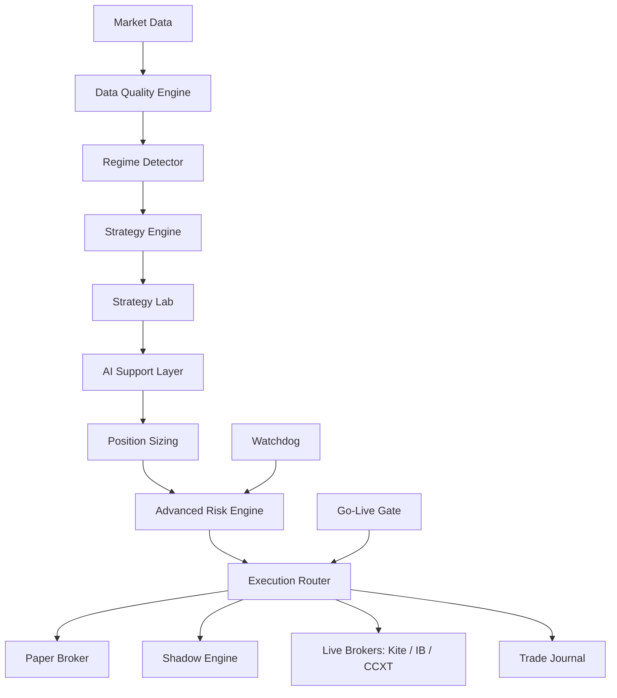

# Apex Trader Architecture

## Overview

Apex Trader is an institutional-grade autonomous trading platform prioritizing **capital preservation** over profit maximization. All signals and AI recommendations pass through immutable risk gates before execution.

## Core Principles

1. **Risk overrides everything** — AI cannot increase limits or bypass halts
2. **Shadow before live** — Real data, simulated fills, weekly comparison
3. **Go-live gate** — Live trading refused unless all validation categories pass
4. **Operational safety** — Watchdog enters safe mode on infrastructure failure

## Services

| Service | Path | Role |
|---------|------|------|
| Gateway | `services/gateway/` | FastAPI REST + dashboard |
| Orchestrator | `services/core/` | Pipeline coordination |
| Risk | `services/risk/` | Base + advanced risk gates |
| Execution | `services/execution/` | Retry, idempotency, routing |
| Brokers | `services/brokers/` | Kite, IB, CCXT, paper |
| Shadow | `services/shadow/` | Simulated fills, slippage tracking |
| Backtest | `services/backtest/` | Walk-forward, Monte Carlo |
| Go-Live | `services/golive/` | Readiness scoring |
| Watchdog | `services/watchdog/` | Health checks, safe mode |
| Journal | `services/journal/` | Decision audit trail |

## Trading Modes

| Mode | Data | Orders | Use |
|------|------|--------|-----|
| `paper` | Synthetic/live | Simulated broker | Development |
| `shadow` | Real | Simulated fills only | Pre-live validation |
| `live` | Real | Real broker (gated) | Production |

## Data Flow

1. Market data ingested and scored by data quality engine
2. Regime classified → strategy subset selected
3. Signals ranked by AI (advisory only)
4. Position size computed (fixed risk / ATR / Kelly capped / portfolio)
5. Advanced risk evaluates sector, correlation, monthly loss, vol adjustment
6. Execution router places order (or simulates in shadow)
7. Journal records full decision context

## Persistence

- **PostgreSQL** — Audit, positions (async SQLAlchemy)
- **Redis** — Event bus
- **JSONL** — Shadow fills (`data/shadow/`), journal (`data/journal/`)
